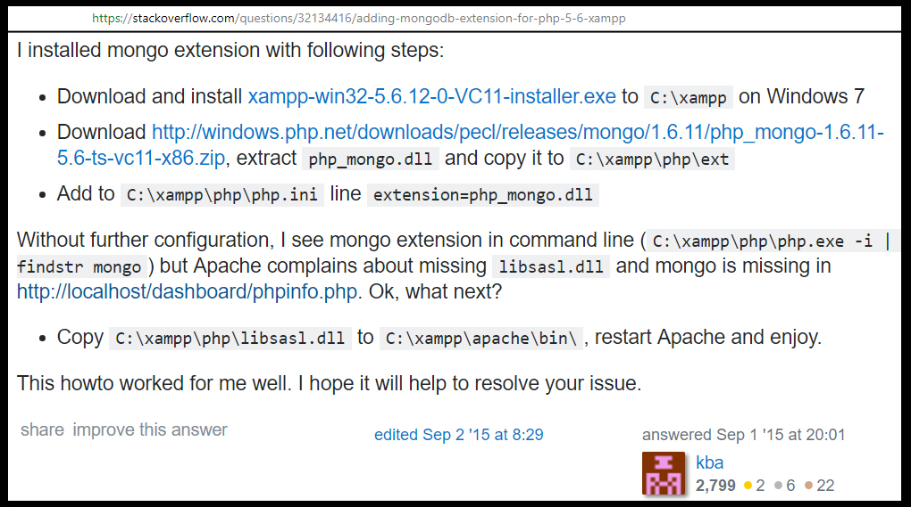
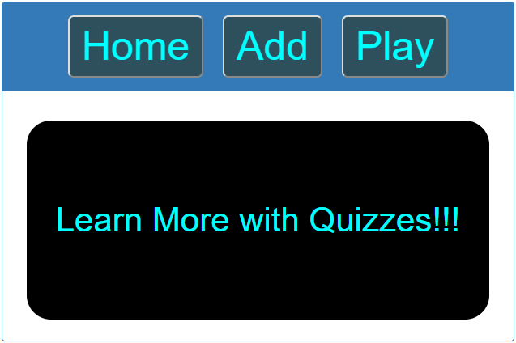
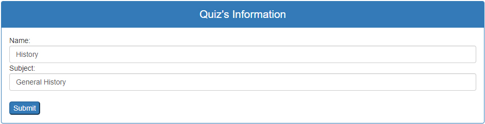
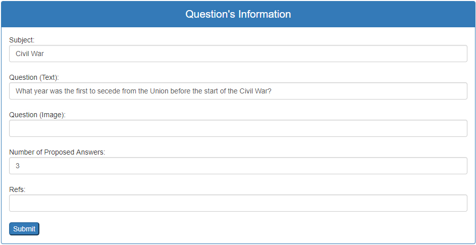
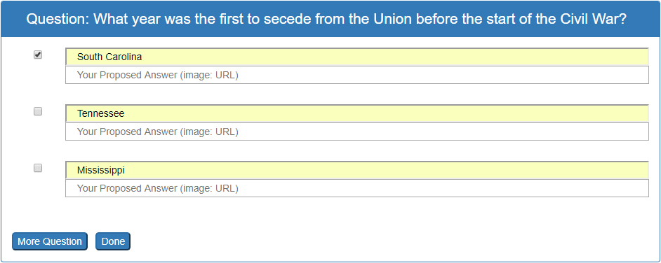
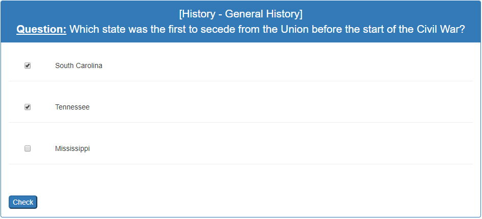
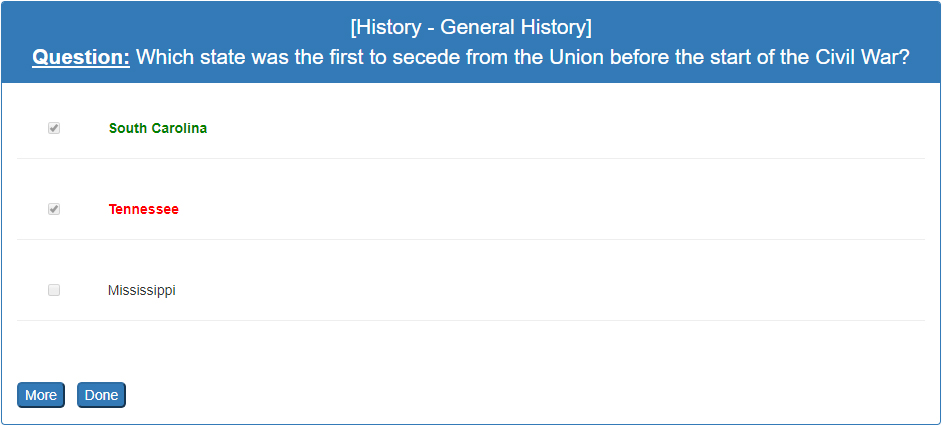

# Quiz Using PHP and MongoDB

----

## Goal
To learn how to use "**PHP**" with a database. The **UI** (User Interface) is rudimentary but functional. The main purpose is to learn one more language: the "**PHP**".

Using "**CSS**", "**Bootstrap**" and "**jQuery**" along with PHP to make a beautiful user interface. 

## Observations
This application is used to show how three part of a 3-tier Architecture work together. So we have:

	user interface <==> PHP <==> MongoDB


## Problem
We need to install a driver of MongoDB to allow PHP to work with the database. If we use XAMPP, we should not use the last version because there is no Mongo's driver for it. Instead, we should follow  some particular steps ([here](https://stackoverflow.com/questions/32134416/adding-mongodb-extension-for-php-5-6-xampp)) or:



## User Interface

---


### Homepage



---

### Add Quiz's Info



---

### Add Question's Info



---

### Add Proposed Answers



---

### Try to answer the question



---

### Check Answers



---
 

## Execution
Developing using **XAMPP** as server. To execute the application:
```
	1. open XAMPP then turn on the Apache module.
	2. open an Internet browser then enter: "localhost/quiz_PHP/documents"
```

---------------

## Author
* Dinh HUYNH - All Rights Reserved!
* dinh.hu19@yahoo.com


 
